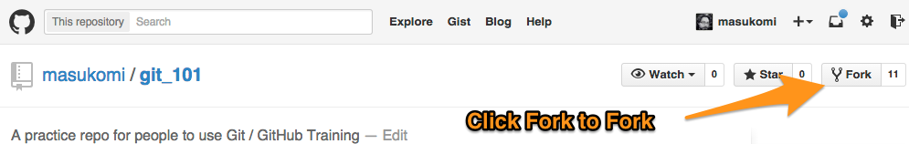
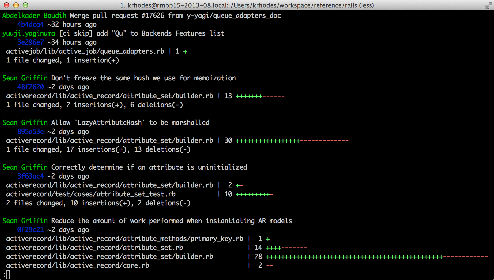
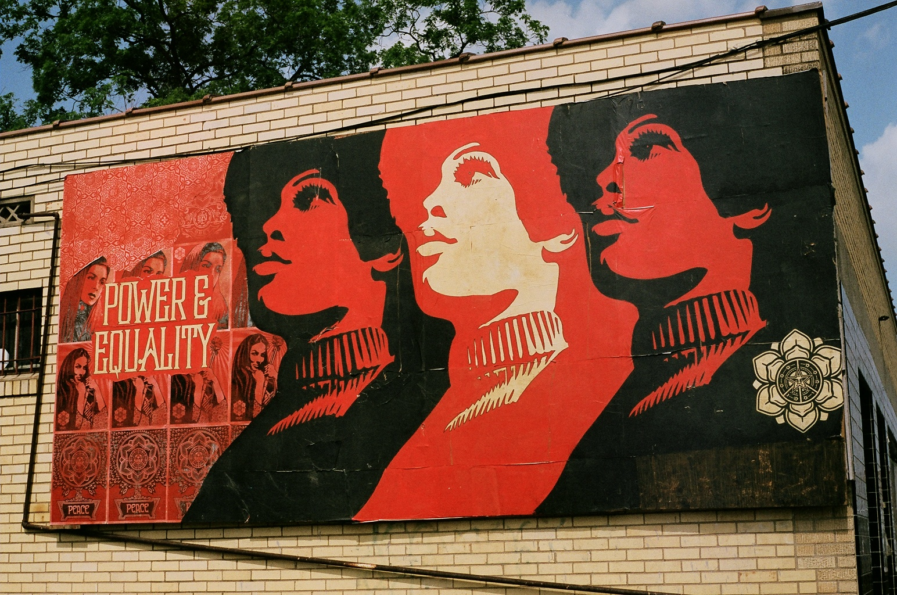

#[fit] Git 101
# by @masukomi

^
This document designed for use with [Deckset](http://www.decksetapp.com/)
The `---` lines are slide dividers.
Everything after a `^` (like this) is a presenter's note.

---

#Pre-requisites
(make the current branch show up in your prompt)

* Google `git prompt`
	* You should end up here: <https://github.com/git/git/blob/master/contrib/completion/git-prompt.sh>
* Click "RAW" & Download it.
* follow the instructions under "To enable"

---

# Terminology

* git - a distributed version control system that lives on your computer
* GitHub - a company that hosts git repositories in the cloud

---

# One Time Config:
## Tell git who to credit your commits to

	$ git config --global user.name "John Doe"
	$ git config --global user.email johndoe@example.com

On a work computer this should be your work email and the name you use at work.

---

# One Time Config:

Go to 
<https://github.com/settings/emails>  
and make sure GitHub knows about the email address you just told git about.

---

## [fit] Why use Version 
## [fit] Control Systems?

^ 
* backup
* ability to revert
* explore ideas
* share

---

## [fit] Working With 
## [fit] Existing Code

---
## Let's do it!

1. go to <http://github.com/masukomi/git_101>

^ Explain web URL vs repo URL

---
## Let's do it!

1. Go to <http://github.com/masukomi/git_101>
2. Fork the repo

^ Explain the concept of `git clone` & that forking just makes a clone on GitHub servers.

---
## Let's do it!

1. Go to <http://github.com/masukomi/git_101>
2. Fork the repo
3. Clone it locally

Get the SSH url from *your fork on GitHub*
 

Don't click the buttons!
 
^ explain http url vs. ssh on repo URL

---

## Status Check
Right now, this is how the repos are configured.

^ 
* Your local clone can push and pull to your fork. 
* Your fork can pull from the central repo. 
* Nothing can push to the central
* Your clone doesn't know about the central. 

---

# Terminology

* (git) repository (A.K.A. repo) - a place that stores your changes.
* (git) branch - a series of commits that have diverged from other branches (typially to be merged back later)

A git repo is just a big [Directed Acyclic Graph](https://en.wikipedia.org/wiki/Directed_acyclic_graph) of commits.

---
## Let's do it!

## 4. Make a topic branch

	git checkout -b adding_myself_to_alumni_file
	
This will create a topic branch *and* check it out
(switch to it).

---

##[fit] Don't Use this: 

	git branch <branchname>
	
It leaves open the possibility of working on the wrong branch.
	
^ 
why?
1. doesn't switch to new branch after creation
2. what if someone walks over and interrupts you before you switch?

---

#[fit] Q: Why use topic branches?

^ 
* much harder to swich tasks without them
* much harder to abandon work without them
* without them pull-requests become problematic 

---
## Let's do it!

1. Go to <http://github.com/masukomi/git_101>
2. Fork the repo
3. Clone it locally
4. make a topic branch
5. Add yourself to the `alumni.md` file

---

## Let's do it!

6. Prep your commit
	* `git status` 
		*  to see what's changed in your repo

^ 
note the "Changes not staged for commit" message at status
run status again. "Changes to be committed"

---

## telling git about changes / additions

	git add . # never use this
	git add -u # adds all changes to files already tracked
	git add path/to/file.md 
		# adds changes to that file
		# OR simply tells git to start tracking new file
	git add -i 
		# much interactive coolness

^ explain about `git add .`

---

## Let's do it!

6. Prep your commit
	* `git status` 
		*  to see what's changed in your repo
	* run the `git add` variant of your choice

^ 
Run status again. note the "Changes to be committed"

---
# One time (optional) config:
## The default editor
`git commit` will open up your default editor (usually `vim`).  Override by: 
* changing `$EDITOR`
* leveraging the global git config:
	* `git config --global core.editor open` 
	* "open" is a system app on OS X. Replace with whatever you want. 

---

## Note:
If you're using a non-terminal editor like [Sublime](http://www.sublimetext.com/) 
you'll make your changes, save, and then *close the window*.

Closing the window causes git to ingest your changes. 

---

## [fit] Before we commit...

---

## [fit] What are the key parts 
## [fit] of a commit message?

---  

Read [Tim Pope's "A Note About Git Commit Messages"](http://tbaggery.com/2008/04/19/a-note-about-git-commit-messages.html)

---

## [fit] Key aspects of 
## [fit] the subject line?

^ 
* Tell them 
* length: because if too long it'll either go off the edge of the screen or wrap and be hard to read.
* length: because it could actually be used as an email subject

---
# Subject should:

1. Give coworkers enough info to determine if your changes have any impact on them.
2. Never force coworkers to look at code to have a clue what you did. 
3. Be useful when trying to figure out what change broke things.

---

# Body should:

* Explain and or / fill in the details not addressed in the subject.
* Be wrapped at ~74 chars.

## and should *not*
* include a list of all the changed files

^ ask why it shouldn't contain list of changed files
---

## [fit] Why is there a blank line
## [fit] between subject and body?

---

## Back to our changes

	git status 
		# to double check what's about to be committed
	git commit
		# to commit it
		# *not* `git commit -m` (that leads to bad habits)
	
Things to watch out for:

* "Changes *not* staged for commit"
* "Changes to be committed" <-- it should show up there

---

## [fit] Did it work?

---

##[fit] *Always* read the instructions

---

##[fit] git told you in its response

---

## [fit] Check the log.

---

# [fit] Git Log

(the most underappreciated bit of git)	

---

## Default Behavior

    git log

---

## Just the subjects

    git log --oneline
    

---

## What files changed?

    git log --stat

---

Something totaly custom: 

    git log --pretty=format:'%Cgreen%an%Creset %s%n    %Cblue%h%Creset %<(20)~%ar'\
    --stat

---

## Status Check
Right now, this is the state of things

^ Why?

---

## Git *never* goes outside without your say-so

^ git fetch (pull), and push

---

## Push it! 

	git push origin <my_branch_name>

---

## Status Check
Right now, this is the state of things

---

##[fit] Now Make a Pull Request

Go to *your fork* on GitHub

([docs are here](https://help.github.com/articles/creating-a-pull-request/))

^ note that Pull Requests are GitHub specific things
* go to your fork on GitHub

---

#[fit] Q: How do you know your changes
#[fit] don't conflict with others?

---

#[fit] A: merge them 
#[fit] & see what happens.

---

#[fit] Q: How do we get
#[fit] other people's changes?

^ modify the `alumni.md` file *now* to 
include the class date. Should result in confilct for students.

---

##[fit] First we need to connect your 
##[fit] local repo with the upstream.

---

# Terminology

* remote repository - any repo that is connected to the current repo

---

##[fit] *All* Repos Are Created *Equal*

^ 
Q: what are the implications of that statement?
Q: So how do you know where to look for the latest code?

---
## run this

	git remote -v

You'll see something like

	$ git remote -v
	origin	git@github.com:my_username/git_101.git (fetch)
	origin	git@github.com:my_username/git_101.git (push)

---

#[fit] Adding a second remote

	git remote add <name for remote> <SSH url of remote>
	
## Let's do this

	git remote add upstream git@github.com:masukomi/git_101.git

Don't *type* that SSH url. *Copy it* from the repo you want to be "upstream".

---

## Status Check
Right now, this is how the repos are configured.

Even if you have permission to push to the "central" repo you *never* should. Use a PR instead.

---

# Pulling Down changes

	git fetch <repo or --all>
	git pull <repo> <branch>

## Note:
This is one of the *2* times when git will talk to the outside world.

^ 
* Explain the difference
* ask about
	* `git pull upstream topic_branch`
	* `git pull origin topic_branch`
	* `git pull origin master`

---

#*never* 
#[fit] `git push upstream <anything>`

^ Explain why

---

# Moving / Renaming a file
	git mv path/to/file.txt new_path/to/files_new_name.txt

That moves / renames the file, & adds it to the index. 

*You still need to commit the change.*

---

# Removing a file

	git rm path/to/file.txt	
	
That deletes the file, and tells git about the deletion.

*You still need to commit the change.*

---

## Git is *very* careful with your data

^ 
You'll regularly encounter complaints from git 
where you've told it to do something that would harm your data. 

---

##[fit] Git will police your actions

### Things that can hurt others: 
* pushing to the "central" repo with force ( `-f` )

### Things that can hurt you:
* `git reset --hard <anything>`
* general stupidity

---

##[fit] If your coworkers have pulled 
##[fit] recently *anything is recoverable*.
---

#[fit] Thank You

# Questions? 
## @masukomi on twitter

---

# Image Credits

* [Bubbles on her fingers](https://flic.kr/p/8dqHe6) [by cc-nd 2.0](https://creativecommons.org/licenses/by-nc/2.0/) Rachel
* [silence](https://www.flickr.com/photos/citizen_poeta/1446906402) [by nc-nd-2.0](https://creativecommons.org/licenses/by-nc-nd/2.0/) Alberto Oritz
* [equality](https://www.flickr.com/photos/monkeygrimace/12541769263) [by nc-nc-nd 2.0](https://creativecommons.org/licenses/by-nc-nd/2.0/) Paul Simpson
* [Instructions for monkeys](https://flic.kr/p/aaBZ1) [by cc-by-2.0](https://creativecommons.org/licenses/by/2.0/) Jackie
* [Motorcycle Police](https://www.flickr.com/photos/skynoir/14092724776) [by-nc-2.0](https://creativecommons.org/licenses/by-nc/2.0/) Bill Dickinson

---